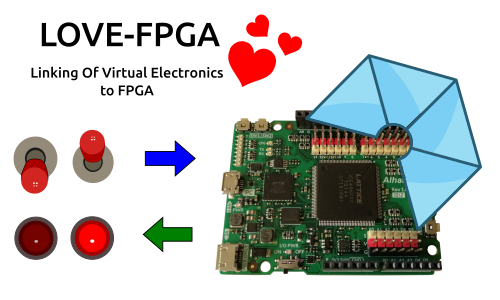

# LOVE-FPGA
Linking Of Virtual Electronics to FPGAs 🙂. Use virtual components with real hardware for debugging without simulation

* You can find examples and blocks for accessing the virtual components in the  
[LOVE-FPGA collection](https://github.com/FPGAwars/LOVE-FPGA-Collection)

* [Information about the Web panels with virtual componentes](https://github.com/FPGAwars/LOVE-FPGA/wiki)
