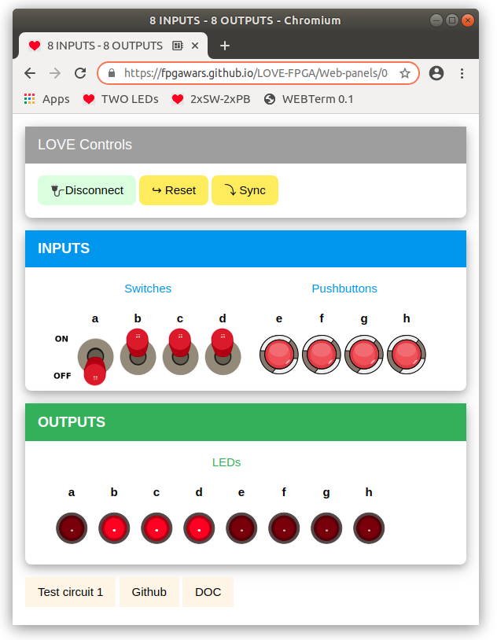

## Panel with 4 Switches, 4 PUshbuttons and 8 LEDs

* Upload this **test circuit** into the FPGA: [Panel-test.ice](https://github.com/FPGAwars/LOVE-FPGA/raw/master/Web-panels/04-Switches-04-Buttons-08-LEDs/Panel-test.ice)
* Connect to the **Web-panel** on this URL: [Two LEDs panel](https://fpgawars.github.io/LOVE-FPGA/Web-panels/04-Switches-04-Buttons-08-LEDs/panel.html)

* More information on the [WIKI PAGE](https://github.com/FPGAwars/LOVE-FPGA/wiki/Panel:-4-Switches,-4-Pulsadores-y-8-LEDs)
