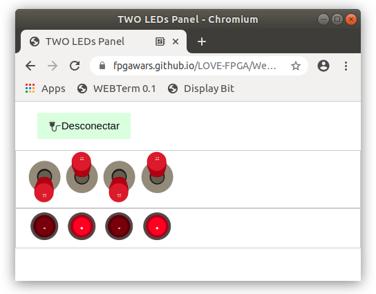

## Panel with FOUR LEDS and FOUR Swtiches

* Upload this **test circuit** into the FPGA: [Panel-test.ice](https://github.com/FPGAwars/LOVE-FPGA/raw/master/Web-panels/Four-LEDs-four-Switches/Panel-test.ice)
* Connect to the **Web-panel** on this URL: [Four LEDs and FOUR switches panel](https://fpgawars.github.io/LOVE-FPGA/Web-panels/Four-LEDs-four-Switches/panel.html)

* More information on the [WIKI PAGE](https://github.com/FPGAwars/LOVE-FPGA/wiki/Panel:-dos-LEDs)
