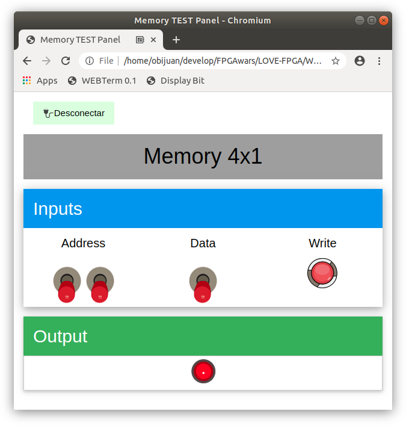

## TEST panel for a 4x1 Memory

* Upload this **test circuit** into the FPGA: [Panel-test.ice](https://github.com/FPGAwars/LOVE-FPGA/raw/master/Web-panels/Memory-4x1-test/Memory-4x1-test.ice)
* Connect to the **Web-panel** on this URL: [Panel de prueba de Memoria 4x1](https://fpgawars.github.io/LOVE-FPGA/Web-panels/Memory-4x1-test/panel.html)

* More information on the [WIKI PAGE](https://github.com/FPGAwars/LOVE-FPGA/wiki/Panel:-Test-de-memoria-de-4x1)
