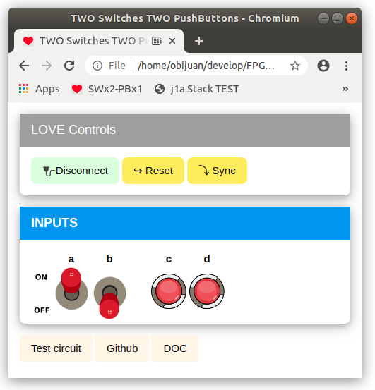

## Panel with TWO Switches and ONE Pushbutton

* Upload this **test circuit** into the FPGA: [Panel-test.ice](https://github.com/FPGAwars/LOVE-FPGA/raw/master/Web-panels/Two-Switches-One-Pushbutton/panel-test.ice)
* Connect to the **Web-panel** on this URL: [Two Switches and Two Pushbuttons panel](https://fpgawars.github.io/LOVE-FPGA/Web-panels/Two-Switches-Two-PushButtons/panel.html)

* More information on the [WIKI PAGE](https://github.com/FPGAwars/LOVE-FPGA/wiki/Panel:-2-switches-y-2-pulsadores)
